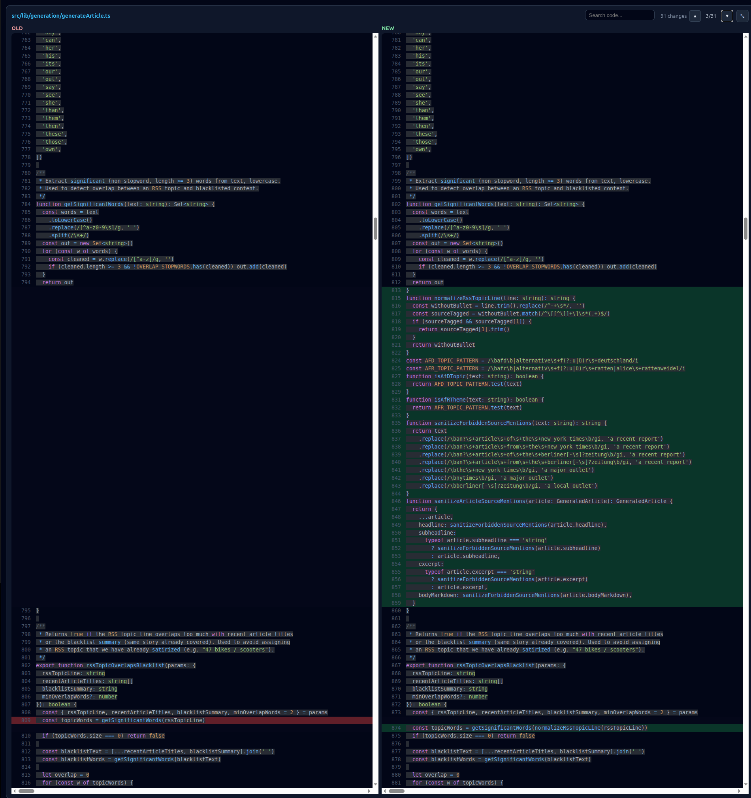
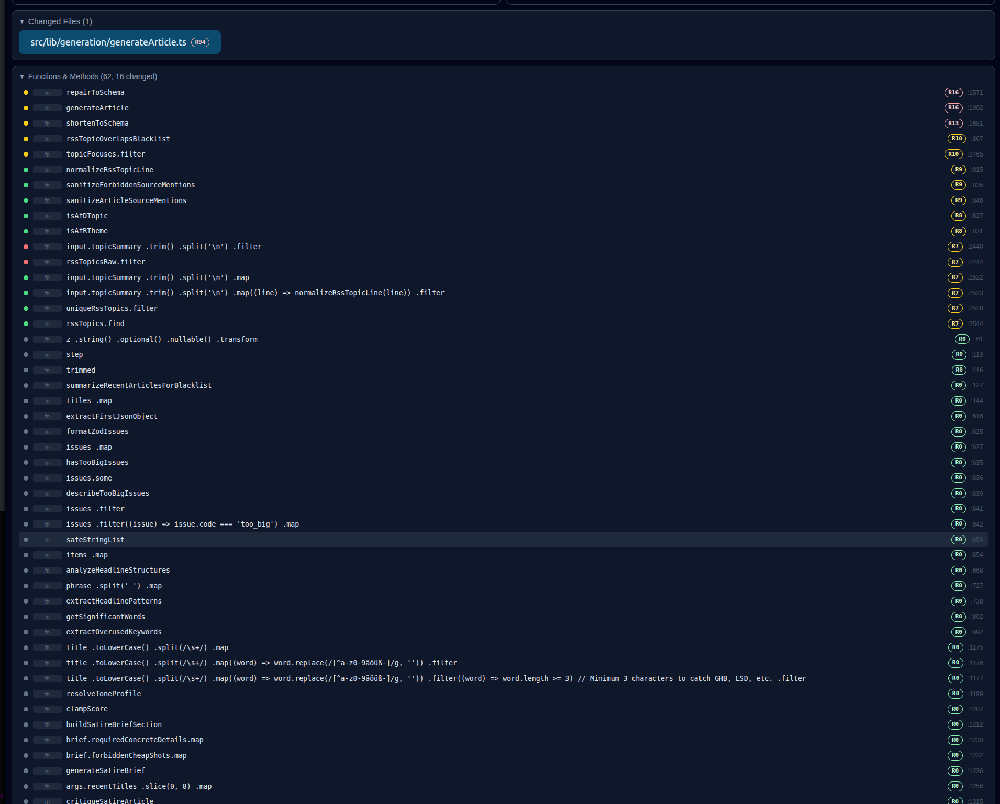

# DiffGraph

DiffGraph is a CLI + browser app that compares code changes as **interactive graphs** instead of only line-by-line diffs.

It supports:
- logic-flow change view
- knowledge-graph change view (classes, functions, services, etc.)
- React/frontend structure change view
- split screen visualization (old on the left, new on the right)

## 60-Second Quick Start

```bash
npm install
npm run build
node dist/src/cli/index.js staged
```

What happens:
1. DiffGraph analyzes your current uncommitted changes.
2. It starts a local server on `http://localhost:4177` (or next free port).
3. It opens the browser so you can review structural changes immediately.

## Visual Preview


| Code Diff | Logic View | Symbols View |
| --- | --- | --- |
|  |  |  |

## When To Use DiffGraph vs `git diff`

- Use `git diff` when:
  - you need exact line patches quickly
  - the change is very small and localized
  - you are editing commit messages or patching directly
- Use DiffGraph when:
  - you want fast understanding of flow/structure impact
  - changes touch multiple files/symbols
  - you want to jump graph <-> code and review by risk first

## Requirements

- Node.js 20+ (recommended)
- npm 10+
- Python 3 (for Python AST analysis)
- Git (for staged/branch diff modes)
- Optional: Neo4j (if you want persisted snapshots)

## Installation

```bash
git clone <your-repo-url>
cd diffgraph
npm install
```

Build CLI + web assets:

```bash
npm run build
```

Run all validations:

```bash
npm run test
npm run type-check
npm run lint-staged
npx tsc --noEmit
```

## Neo4j Setup (Optional)

If set, DiffGraph stores snapshots in Neo4j. Otherwise, it falls back to in-memory storage.

```bash
export NEO4J_URI=neo4j://localhost:7687
export NEO4J_USER=neo4j
export NEO4J_PASSWORD=your_password
```

## CLI Usage

After `npm run build`, run:

```bash
node dist/src/cli/index.js <command>
```

## Using DiffGraph in Other Repositories

You can use this project as a central tool to analyze any repository on your machine.

### Option 1: Run from this project with `--repo` (recommended)

```bash
node dist/src/cli/index.js staged --repo /path/to/other-repo
node dist/src/cli/index.js -b main feature --repo /path/to/other-repo
node dist/src/cli/index.js analyze --repo /path/to/other-repo --ref WORKTREE
```

For file-to-file mode, pass two explicit file paths:

```bash
node dist/src/cli/index.js -ff /path/to/file_old.ts /path/to/file_new.ts
```

### Option 2: Install a global local command with `npm link`

```bash
npm install
npm run build
npm link
```

Then run from anywhere:

```bash
diffgraph staged --repo /path/to/other-repo
diffgraph -b main feature --repo /path/to/other-repo
```

If you are already inside the target repo, `--repo` is optional:

```bash
cd /path/to/other-repo
diffgraph staged
```

### Option 3: Run directly with `npx tsx` (development mode)

```bash
npx tsx /home/milton-laufer/diffgraph/src/cli/index.ts staged --repo /path/to/other-repo --no-open
```

This is useful while developing, but the built CLI is preferred for normal usage.

### 1) Uncommitted changes (`staged`)

By default, `staged` compares **all uncommitted changes** (staged + unstaged) against `HEAD`:

```bash
node dist/src/cli/index.js staged
```

Use only staged changes:

```bash
node dist/src/cli/index.js staged --staged-only
```

Quick rule of thumb:
- `diffgraph staged` = equivalent scope to `git diff HEAD` (everything not committed yet)
- `diffgraph staged --staged-only` = equivalent scope to `git diff --staged` (only what is in the index)

If `--staged-only` appears empty, run `git add <files>` first.

Use custom repo path and port:

```bash
node dist/src/cli/index.js staged --repo /path/to/repo --port 4177
```

### 2) File-to-file mode (`-ff`)

Compare two files directly:

```bash
node dist/src/cli/index.js -ff old_version.ts new_version.ts
```

### 3) Branch-to-branch mode (`-b`)

Compare two branches:

```bash
node dist/src/cli/index.js -b main feature
```

With repo path:

```bash
node dist/src/cli/index.js -b branch1 branch2 --repo /path/to/repo
```

### 4) Analyze snapshot only

Create and persist a graph snapshot for a reference label:

```bash
node dist/src/cli/index.js analyze --repo /path/to/repo --ref WORKTREE
```

## Browser Behavior

Each diff command starts a local server and opens a browser automatically:

```text
http://localhost:<port>/?diffId=<generated-id>
```

If the default port (4177) is busy, the server automatically finds the next available port.

### Tabs

- **Logic** -- flowchart with control-flow branches (if/switch/for/return as diamonds/pills), showing code snippets inline
- **Knowledge** -- structural graph of classes, functions, services, imports, etc.
- **React** -- component render tree and hook usage (shown only when the diff contains React-relevant symbols)

### Graph panels (Old / New)

- Old graph shows only nodes that existed before; New graph shows only nodes that exist after
- Added/Removed/Modified legend appears only on the New panel
- Controls and MiniMap appear only on the New panel
- Both panels share synchronized pan/zoom
- In logic view, dragging the canvas works from node areas too (you are not limited to empty background)

### Interactions

- **Click a node** -- highlights it (cyan border + glow), selects its file below, and scrolls the code diff to that line
- **Click a file pill** -- selects the file, scrolls graphs to related nodes, shows its code diff
- **Risk-ranked file list** -- changed files are sorted by deterministic risk score (graph connectivity + change type + churn)
- **Escape** -- deselects node and file
- **Changes Only** (on by default) -- keeps changed nodes plus required context (hierarchy ancestors and relevant invoke neighbors in Logic view). Toggle off to show full graph.
- **Show calls** (Logic tab) -- show/hide invoke edges to reduce visual noise
- **Graph diff navigation** (Logic tab, up/down arrows) -- jumps across graph-level changes (added/removed/modified nodes) and temporarily highlights the focused node
- **Graph search** (per panel) -- search nodes by text, use up/down arrows to jump matches; matched node is focused and highlighted
- **Hover function/group headers** -- tooltip includes documentation (JSDoc/docstring), parameters with types, return type, and class/file metadata when available
- **Risk-ranked symbols** -- functions/methods/classes inside a file are sorted by deterministic risk score to prioritize review order

### Code diff panel

- Side-by-side view: Old code on the left, New code on the right
- Line-level change highlighting: green for added lines, red for removed lines
- Synchronized scrolling between left and right
- Each side is fixed at 50% width and supports horizontal scrolling for long lines
- New files show "File did not exist" on the old side; deleted files show "File was deleted" on the new side
- Clicking a logic node scrolls the diff to the corresponding line number and scrolls the page to the code viewer
- Clicking a code line can navigate back to the best matching node in the graph
- Fullscreen toggle (top-right icon in code diff panel; `Esc` exits fullscreen)
- Whitespace-only/blank-line-only changes are ignored for semantic change detection to reduce false modified markers

### Suggested workflow

1. Start with **Changes Only** enabled.
2. Use **Graph diff navigation** arrows to inspect each structural change quickly.
3. Click a focused node to inspect exact code in the diff panel.
4. If needed, click a code line to jump back to the graph context.
5. Use **Show calls** to simplify/expand execution-flow context.
6. Use graph **Search** when you know symbol names.

## Development

Quick local run without build:

```bash
npx tsx src/cli/index.ts staged --no-open
```

Run web dev server only:

```bash
npm --prefix web run dev
```

## Troubleshooting

- `Command 'tsc' not found`: use `npx tsc --noEmit` instead of bare `tsc`.
- Empty graph results: ensure the selected mode actually has file changes.
- If `staged` shows empty: there may be no uncommitted changes in that repo.
- If `staged --staged-only` shows empty: changes exist but are not staged yet (`git add` not run).
- Branch mode errors: fetch branches and verify names are correct.
- No browser opening: run without `--no-open`, or copy the printed URL manually.
- Port busy: the server tries up to 20 consecutive ports starting from 4177 (or `--port N`).
- Slow UI on large repos: keep Changes Only enabled (default). The CLI warns when the graph exceeds 2000 nodes.
