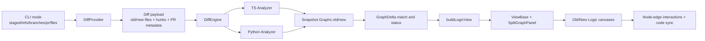
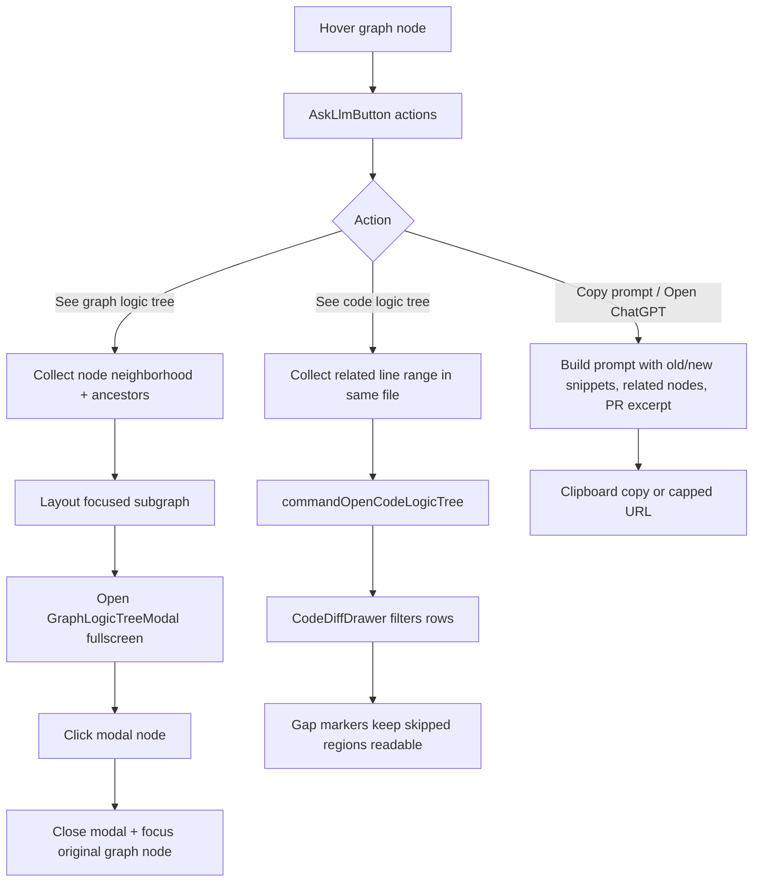

# ~Diff~Graph (AKA "Tell me WTF the LLM did to my code")

[](https://www.npmjs.com/package/diffgraph)
[](https://github.com/miltonlaufer/diffgraph/blob/main/LICENSE)

**Package:** [diffgraph on npm](https://www.npmjs.com/package/diffgraph). Also published to GitHub Packages (appears in the repo sidebar after you [create a release](https://github.com/miltonlaufer/diffgraph/releases)). **Developed with partial support of [neural frames](https://www.neuralframes.com)**

DiffGraph is a CLI + browser app that compares code changes as **interactive graphs** instead of only line-by-line diffs.
It is optimized for **large diffs** where plain patch views become hard to reason about quickly.

It supports:
- logic-flow change view
- knowledge-graph change view (classes, functions, services, etc.)
- React/frontend structure change view
- split screen visualization (old on the left, new on the right)

## 60-Second Quick Start

### Install from npm (recommended)

```bash
npm install -g diffgraph
```

Then go to the repo you want to inspect and run:

```bash
cd /path/to/your-repo
diffgraph
```

### Install from source

```bash
git clone https://github.com/miltonlaufer/diffgraph.git
cd diffgraph
npm install
npm run build
npm link
```

Then go to the repo you want to inspect and run:

```bash
cd /path/to/your-repo
diffgraph
```

This is now the fastest path and the recommended one:
- If the folder is not a Git repo, DiffGraph exits with a clear error.
- Inside a Git repo, it opens an interactive menu (`numbers` + `Enter`, `q` or `esc` to exit):
  - `1) Staged changes`
  - `2) Only staged changes`
  - `3) Branch to branch` (latest 10 branches)
  - `4) Commit to commit` (latest 10 commits)
  - `5) Pull requests` (latest 10 **open** PRs)
  - `6) File to file` (prints the exact `-ff` command)

You can still run direct commands:

```bash
diffgraph staged
diffgraph staged --staged-only
diffgraph -b main feature/your-feature-branch
diffgraph -r <oldCommit> <newCommit>
diffgraph -pr <number>
```

From any folder, pass `--repo`:

```bash
diffgraph staged --repo /path/to/your-repo
diffgraph -b main feature/your-feature-branch --repo /path/to/your-repo
```

What happens:
1. `npm link` installs a global `diffgraph` command from this project.
2. You can run `diffgraph` inside the target repo directly, or from any folder with `--repo`.
3. DiffGraph analyzes uncommitted changes, starts a local server on `http://localhost:4177` (or next free port), and opens the browser.

## Visual Preview


| Code Diff | Logic View | Symbols View |
| --- | --- | --- |
|  |  |  |

## When To Use DiffGraph vs `git diff`

- Use `git diff` when:
  - you need exact line patches quickly
  - the change is very small and localized
  - you are editing commit messages or patching directly
- Use DiffGraph when:
  - you want fast understanding of flow/structure impact
  - changes touch multiple files/symbols
  - you want to jump graph <-> code and review by risk first

## Requirements

- Node.js 20+ (recommended)
- npm 10+
- Python 3 (for Python AST analysis)
- Git (for staged/branch diff modes)
- Optional: Neo4j (if you want persisted snapshots)

## Installation

### From npm

```bash
npm install -g diffgraph
```

### From source

```bash
git clone https://github.com/miltonlaufer/diffgraph.git
cd diffgraph
npm install
```

Build CLI + web assets:

```bash
npm run build
```

Run all validations:

```bash
npm run test
npm run type-check
npm run lint-staged
npx tsc --noEmit
```

## Neo4j Setup (Optional)

If set, DiffGraph stores snapshots in Neo4j. Otherwise, it falls back to in-memory storage.

```bash
export NEO4J_URI=neo4j://localhost:7687
export NEO4J_USER=neo4j
export NEO4J_PASSWORD=your_password
```

## CLI Usage

After `npm run build`, run:

```bash
node dist/src/cli/index.js <command>
```

## Using DiffGraph in Other Repositories

You can use this project as a central tool to analyze any repository on your machine.

### Option 1: Run from this project with `--repo` (recommended)

```bash
node dist/src/cli/index.js staged --repo /path/to/other-repo
node dist/src/cli/index.js -b main feature --repo /path/to/other-repo
node dist/src/cli/index.js -pr 123 --repo /path/to/other-repo
node dist/src/cli/index.js analyze --repo /path/to/other-repo --ref WORKTREE
```

For file-to-file mode, pass two explicit file paths:

```bash
node dist/src/cli/index.js -ff /path/to/file_old.ts /path/to/file_new.ts
```

### Option 2: Install a global local command with `npm link`

```bash
npm install
npm run build
npm link
```

Then run from anywhere:

```bash
diffgraph staged --repo /path/to/other-repo
diffgraph -b main feature --repo /path/to/other-repo
diffgraph -pr 123 --repo /path/to/other-repo
```

If you are already inside the target repo, `--repo` is optional:

```bash
cd /path/to/other-repo
diffgraph staged
```

### Option 3: Run directly with `npx tsx` (development mode)

```bash
npx tsx /path/to/diffgraph/src/cli/index.ts staged --repo /path/to/other-repo --no-open
```

This is useful while developing, but the built CLI is preferred for normal usage.

### 1) Uncommitted changes (`staged`)

By default, `staged` compares **all uncommitted changes** (staged + unstaged) against `HEAD`:

```bash
node dist/src/cli/index.js staged
```

Use only staged changes:

```bash
node dist/src/cli/index.js staged --staged-only
```

Quick rule of thumb:
- `diffgraph staged` = equivalent scope to `git diff HEAD` (everything not committed yet)
- `diffgraph staged --staged-only` = equivalent scope to `git diff --staged` (only what is in the index)

If `--staged-only` appears empty, run `git add <files>` first.

Use custom repo path and port:

```bash
node dist/src/cli/index.js staged --repo /path/to/repo --port 4177
```

### 2) File-to-file mode (`-ff`)

Compare two files directly:

```bash
node dist/src/cli/index.js -ff old_version.ts new_version.ts
```

### 3) Branch-to-branch mode (`-b`)

Compare two branches:

```bash
node dist/src/cli/index.js -b main feature
```

With repo path:

```bash
node dist/src/cli/index.js -b branch1 branch2 --repo /path/to/repo
```

### 4) Ref-to-ref mode (`-r`)

Compare any two Git refs (commits, tags, or branches) using exact `git diff <oldRef> <newRef>` semantics:

```bash
node dist/src/cli/index.js -r <oldRef> <newRef>
```

Example with commit SHAs:

```bash
node dist/src/cli/index.js -r a1b2c3d e4f5g6h
```

### 5) Pull request mode (`-pr`)

Compare a GitHub pull request by number (fetched from `origin` as `pull/<number>/head`):

```bash
node dist/src/cli/index.js -pr 123
```

With repo path:

```bash
node dist/src/cli/index.js -pr 123 --repo /path/to/repo
```

### 6) Analyze snapshot only

Create and persist a graph snapshot for a reference label:

```bash
node dist/src/cli/index.js analyze --repo /path/to/repo --ref WORKTREE
```

## Browser Behavior

Each diff command starts a local server and opens a browser automatically:

```text
http://localhost:<port>/?diffId=<generated-id>
```

If the default port (4177) is busy, the server automatically finds the next available port.

### Tabs

- **Logic** -- flowchart with control-flow branches (if/switch/for/return as diamonds/pills), showing code snippets inline
- **Knowledge** -- structural graph of classes, functions, services, imports, etc.
- **React** -- component render tree and hook usage (shown only when the diff contains React-relevant symbols)

## New Features Since Last Full README Update

Baseline used for this section: the README state before docs-only credit commit `900c399` (feature baseline commit `8f5098e`).

### UI / UX

| Feature | What changed | Why it matters |
| --- | --- | --- |
| Graph logic tree modal | Added `See graph logic tree` from node hover actions; opens a fullscreen focused subgraph modal. | Faster branch-level reasoning without losing full-graph context. |
| Code logic tree mode | Added `See code logic tree` from node hover actions; code diff can filter to related logic ancestry lines. | Moves from graph node to minimal code window quickly. |
| Pull request controls in header | Added `PR ↗` (open on GitHub) and `PR Description` modal (markdown rendering). | PR mode now carries review context directly in the UI. |
| Resizable layout | Integrated resizable panels for graph/code and Old/New split panes. | Better ergonomics for large monitors and small laptops. |
| Performance guard modal | Added runtime lag detection modal with staged mitigations (hide call edges; optionally render one side only). | Keeps app responsive on very large graphs. |
| Node action panel improvements | Ask-LLM floating panel now includes graph/code logic-tree actions, improved tooltip anchoring, and robust copied-state messaging. | Cleaner node-level workflow, fewer missed clicks. |
| Group node detail strips | Function parameter diffs and hook dependency diffs are shown inline in group headers with status coloring. | Makes signature-level API changes visible in graph view. |
| Graph canvas zoom floor | Reduced minimum zoom to `0.01` in split graph panels. | Easier to zoom out for global structure scans. |

### Functionality / Workflow

| Feature | What changed | Why it matters |
| --- | --- | --- |
| PR URL handling | PR mode now resolves URL from `gh pr view` metadata, with fallback from `origin` remote parsing. | Reliable GitHub navigation from DiffGraph PR sessions. |
| PR description propagation | Server exposes PR description + excerpt, and Ask-LLM prompt builders include the excerpt when available. | Explanations can account for stated PR intent. |
| Interactive branch compare fallback | In interactive menu, branch order is auto-reversed if selected order has zero diff files but reverse has changes. | Prevents empty-result confusion in branch mode. |
| Code diff navigation support | Code logic-tree requests are routed through view commands/store into diff drawer filtering and scrolling. | Smooth graph-to-code-to-graph traversal. |
| Escape-to-dismiss support | Added keyboard close behavior for modals such as performance guard and PR description. | Faster keyboard-centric review flow. |

### Analysis Engine / View Semantics

| Feature | What changed | Why it matters |
| --- | --- | --- |
| TypeScript control-flow coverage | Added `try/catch/finally` branch node generation and flow edges; better chained promise branch typing (`then/catch/finally`). | Logic View now captures exception and async error paths more accurately. |
| Python control-flow coverage | Enhanced Python analyzer script to preserve internal flow for `for` loops and `try` blocks (including nested behavior). | Reduces flattened/incorrect control-flow paths in Python diffs. |
| Callback and hook metadata | Improved callback name resolution and hook dependency extraction in TS analysis. | Cleaner labels and better dependency visibility in Logic/React views. |
| React view JSX edges | React view now infers JSX render edges from branch metadata and tag usage. | Better representation of component render relationships. |
| Class/method hierarchy inference | Logic view builder improved class method grouping and parent-child inference. | More stable, understandable group structure in large files. |
| Parameter/dependency diff tracking | Logic view builder computes old/new token-level diffs for function params and hook deps. | Shows what changed inside signatures, not only that something changed. |

### Diff Accuracy / Performance

| Feature | What changed | Why it matters |
| --- | --- | --- |
| Comment-insensitive signatures | Diff/analyzers normalize signatures by stripping comments before hashing. | Comment-only edits no longer look like semantic symbol changes. |
| Graph delta matching improvements | Refined node matching for duplicates/deep callbacks (signature + position-aware pairing). | Fewer false `modified/added/removed` statuses. |
| Whitespace-aware side-by-side diff | Code diff comparison ignores whitespace-only noise and better preserves multiline wrapped visibility. | Cleaner code review signal with less formatting noise. |
| Neighborhood/derived caching | Added cached neighborhood strategies and memo-hash based worker inputs for derived/layout computations. | Better responsiveness on dense graphs and repeated interactions. |
| Debounced search | Added debounced graph/code search inputs in heavy paths. | Reduces UI churn and expensive recompute bursts. |
| Expanded tests | Added/expanded tests for graph delta, control-flow analyzers, diff utils, node identity, and view commands. | Higher confidence in behavior across large and edge-case diffs. |

### Logic View Flow (Mermaid)





### Graph panels (Old / New)

- Old graph shows only nodes that existed before; New graph shows only nodes that exist after
- Added/Removed/Modified legend appears only on the New panel
- Controls appear only on the New panel; MiniMap appears on both Old and New panels
- Both panels share synchronized pan/zoom (with temporary hover-focus adjustments when needed)
- In logic view, dragging the canvas works from node areas too (you are not limited to empty background)
- In logic view, top-level alignment keeps Old/New function blocks comparable while preserving nested hierarchy
- Parent/scope blocks run overlap resolution to reduce block collisions in dense graphs

### Interactions

- **NEW: ASK LLM from any hovered node** -- hover a node and use the floating actions outside the node: `Copy prompt` (clipboard) or `Open ChatGPT ↗` (new tab). The generated prompt includes the current-side code, matching old/new counterpart code when available, connected-node context, and graph relation details. For very large prompts, the ChatGPT URL payload is capped and appends `[PROMPT CUT BECAUSE OF URL LENGTH LIMIT]` so truncation is explicit.
- **Click a node** -- highlights it (cyan border + glow), selects its file below, and scrolls the code diff to that line
- **Changed Files auto-collapse on node click** -- selecting a node collapses the Changed Files block; when collapsed it shows `Selected: <filename>` in the header
- **Click a connector/edge** (Logic tab) -- first click focuses the source node; clicking the same connector again focuses the target node
- **Clicked connector highlight** -- the selected connector remains emphasized for ~5 seconds
- **Hover a connector/edge** -- shows a source/target tooltip for faster graph tracing
- **Click a file pill** -- selects the file, scrolls graphs to related nodes, shows its code diff
- **File switch resets searches** -- changing or clearing the selected file clears graph search and code search
- **Risk-ranked file list** -- changed files are sorted by `R` score:
  - **graph connectivity** = how many other symbols call into changed symbols (high fan-in => wider impact)
  - **change type** = rename/add/delete/type-changed adds extra risk boost
  - **churn** = how many lines were added/removed
  - thresholds: **`R >= 25` = high**, **`R >= 12` = medium**, below 12 = low (see **Risk score (`Rxx`) details** below)
- **Escape** -- deselects node and file
- **Changes Only** (on by default) -- keeps changed nodes plus required context (hierarchy ancestors and relevant invoke neighbors in Logic view). Toggle off to show full graph.
- **Show calls** (Logic tab) -- show/hide invoke edges to reduce visual noise
- **Graph diff navigation** (Logic tab, up/down arrows) -- jumps across graph-level changes (added/removed/modified nodes) and highlights the focused node for ~5 seconds
- **Graph search** (per panel) -- search nodes by text, use up/down arrows to jump matches; matched node is focused and highlighted, and related connections are emphasized during the flash window
- **Arrow keys behavior** -- `ArrowUp`/`ArrowDown` follow this priority: (1) if `Search code...` is filled, navigate code-search matches, (2) else if graph search is filled and `exclude` is off, navigate graph-search matches, (3) else navigate graph differences in Logic view (same as the up/down diff buttons)
- **Hover function/group headers** -- tooltip includes documentation (JSDoc/docstring), parameters with types, return type, and class/file metadata when available
- **Node hover -> code preview** -- when code diff is open, hovering a graph node previews the corresponding code line; leaving hover restores the selected line
- **Risk-ranked symbols** -- functions/methods/classes inside a file are sorted by deterministic risk score to prioritize review order
- **Code line -> graph focus** -- clicking a code line finds the best matching graph node, highlights it for ~4.2 seconds, and keeps the graph area in view
- **Double-click code word -> code search** -- double-clicking a word in the diff fills `Search code...` and jumps to the first textual match

### Risk score (`Rxx`) details

The `R38` / `R28` badge on each file pill is the file-level `riskScore` computed server-side in `src/server/app.ts`.

File-level formula:

```text
riskScore = symbolRisk + churnScore + connectivityScore + statusBoost
```

- `symbolRisk`: sum of the top 8 changed symbols' scores in that file
- `churnScore`: `min(10, floor(churn / 15))`, where `churn` is added/removed diff lines from hunks
- `connectivityScore`: `min(6, floor(hotspotFanIn / 2))`
- `statusBoost`:
  - `renamed`: `+2`
  - `deleted` or `added`: `+2`
  - `type-changed`: `+3`
  - otherwise: `+0`

Risk level thresholds (this is where `12` and `25` come from):

- `low`: `< 12`
- `medium`: `>= 12` and `< 25`
- `high`: `>= 25`

Symbol-level score (used by `symbolRisk`) is also computed in `src/server/app.ts` (`computeSymbolRiskScore`) and combines:
- diff status weight (`added`/`removed`/`modified`)
- symbol kind weight (`Class`, `Function`, `Method`, `ReactComponent`, `Hook`)
- span size, call fan-in/out, ownership, and public API heuristic

### Code diff panel

- Side-by-side view: Old code on the left, New code on the right
- Line-level change highlighting: green for added lines, red for removed lines
- Hovering a line highlights that row for easier scanning
- Graph-selected line uses a persistent white border; hover preview uses a blue border
- Active code search highlights matching words inline inside code lines
- Synchronized scrolling between left and right
- Each side is fixed at 50% width and supports horizontal scrolling for long lines
- New files show "File did not exist" on the old side; deleted files show "File was deleted" on the new side
- Clicking a logic node scrolls the diff to the corresponding line number and scrolls the page to the code viewer
- Clicking a code line can navigate back to the best matching node in the graph (including full-file add/remove views)
- Code search matching runs across both Old and New columns
- Fullscreen toggle (top-right icon in code diff panel; `Esc` exits fullscreen)
- Whitespace-only/blank-line-only changes are ignored for semantic change detection to reduce false modified markers

### Performance and responsiveness

- Layout and large graph transforms are processed in Web Workers with guarded fallbacks
- Derived computations (view filtering, search matching, hover neighborhoods, and diff stats) run off the main thread when available
- Expensive interactions trigger an immediate local "Updating graph..." overlay before updates apply
- The default review flow and graph interactions are tuned for large, multi-file diffs

### Suggested workflow

1. Start with **Changes Only** enabled.
2. Use **Graph diff navigation** arrows to inspect each structural change quickly.
3. Click a focused node to inspect exact code in the diff panel.
4. If needed, click a code line to jump back to the graph context.
5. Use **Show calls** to simplify/expand execution-flow context.
6. Use graph **Search** when you know symbol names.

## Development

Quick local run without build:

```bash
npx tsx src/cli/index.ts staged --no-open
```

Run web dev server only:

```bash
npm --prefix web run dev
```

## Troubleshooting

- `Command 'tsc' not found`: use `npx tsc --noEmit` instead of bare `tsc`.
- Empty graph results: ensure the selected mode actually has file changes.
- If `staged` shows empty: there may be no uncommitted changes in that repo.
- If `staged --staged-only` shows empty: changes exist but are not staged yet (`git add` not run).
- Branch mode errors: fetch branches and verify names are correct.
- No browser opening: run without `--no-open`, or copy the printed URL manually.
- Port busy: the server tries up to 20 consecutive ports starting from 4177 (or `--port N`).
- Slow UI on large repos: keep Changes Only enabled (default). The CLI warns when the graph exceeds 2000 nodes.

## License

This project is licensed under the [MIT License](LICENSE).
